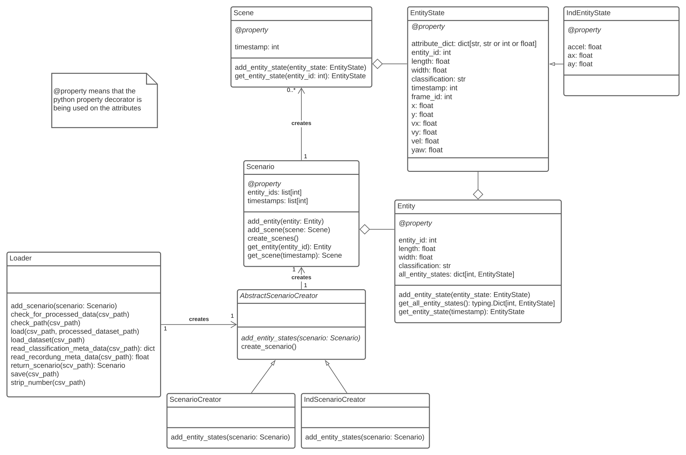

# semantic_scene_graph_loader

This is a part of [semantic_scene_graph](https://git.scc.kit.edu/uyfwd/semantic_scene_graph_ws).

Reads in .csv files in either .taf or inD format and creates an object structure based on the following class diagram:



The constructed Scenario can then be used by [semantic_scene_graph_computation](https://git.scc.kit.edu/uyfwd/semantic_scene_graph_computation).

## Documentation

See the [documentation](https://student.kit.edu/~ulmcn/ssg_docs) of the whole [semantic_scene_graph](https://git.scc.kit.edu/uyfwd/semantic_scene_graph_ws) project.

## Usage

1. initialize an object of the Loader class with the wanted parameters
2. run `your_loader_object.load_dataset(csv_path)`
3. get your Scenario with `your_loader_object.return_scenario(csv_path)`
4. use the Scenario with the [Computation module](https://git.scc.kit.edu/uyfwd/semantic_scene_graph_computation) or another application

### Example

The main function in [controller.py](https://git.scc.kit.edu/uyfwd/semantic_scene_graph_ws/-/blob/main/controller.py) shows how it is done.

```python
def main(self, csv_path, osm_path, origin, timestamp_list, clean_load, verbose):
        """Runs the core modules one after another"""
        loader = Loader()
        try:
            loader.load_dataset(csv_path, clean_load=clean_load, verbose=verbose)
        except SystemExit as e:
            print("Dataset " + str(csv_path) + ": " + repr(e))
            raise e
        scenario = loader.return_scenario(csv_path)
        if not timestamp_list:
            timestamp_list = scenario.timestamps

        coordinator = computation_interface.Coordinator(
            scenario, osm_path, origin, timestamp_list, verbose
        )
        coordinator.coordinate()
        # computes the semantic scene graphs
```
