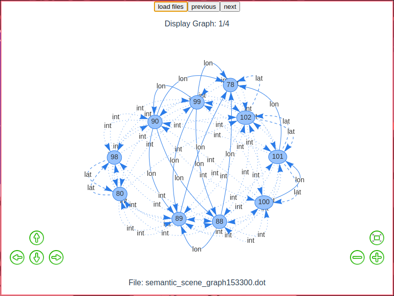
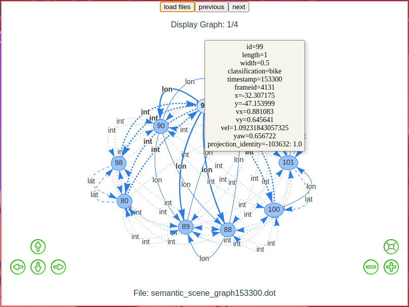
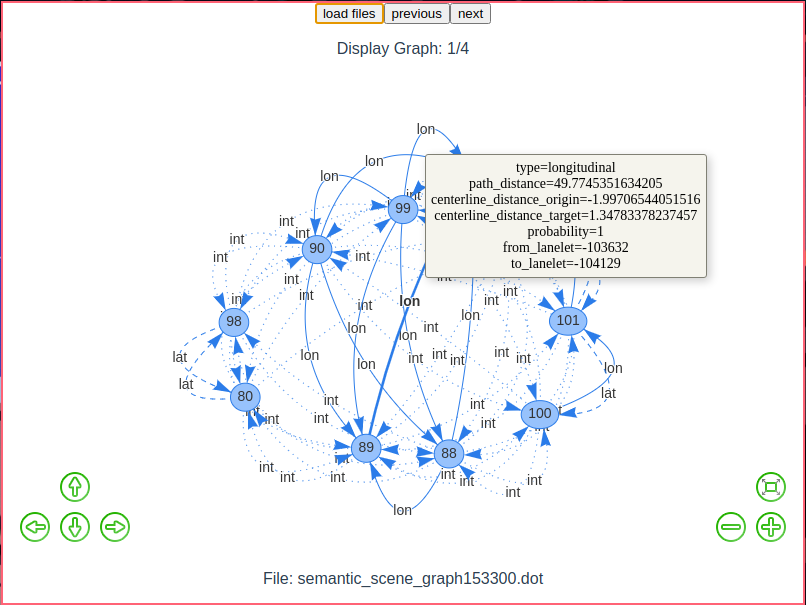

# semantic_scene_graph_visualization

This is a part of [semantic_scene_graph](https://git.scc.kit.edu/uyfwd/semantic_scene_graph_ws).

Renders an interactive graph from multiple DOT graph language files. When using multiple DOT files it is possible to go through them one by one in the GUI using the next and previous buttons.
Allows clicking on the edges for seeing the edge's attributes. Supports normal, dashed and dotted edges. For more info see the [section on DOT files](###Requirements-for-DOT-files-when-using-this-tool).

### Requirements for DOT files when using this tool

- file names: \<timestamp\>.dot
- edge attributes should be given as normal attributes but `label` will not be displayed as an attribute but as the actual node label
- normal, dashed or dotted edges noted as
  - `style=dashed` in case of dashed edge
  - `style=dotted` in case of dotted edge
  - `style=None` or no edge attribute in case of normal edge

### Install dependencies 

```bash
npm install
```

### Test

```bash
npm run dev # starts application with hot reload
```

## Building

```bash
npm run build:win # uses windows as build target
npm run build:mac # uses mac as build target
npm run build:linux # uses linux as build target
```

## Usage
### Startup screen


### DOT file read
There are example DOT files in [test](https://git.scc.kit.edu/uyfwd/semantic_scene_graph_visualization/-/tree/main/test).


### Hover over vertex


### Hover over edge
